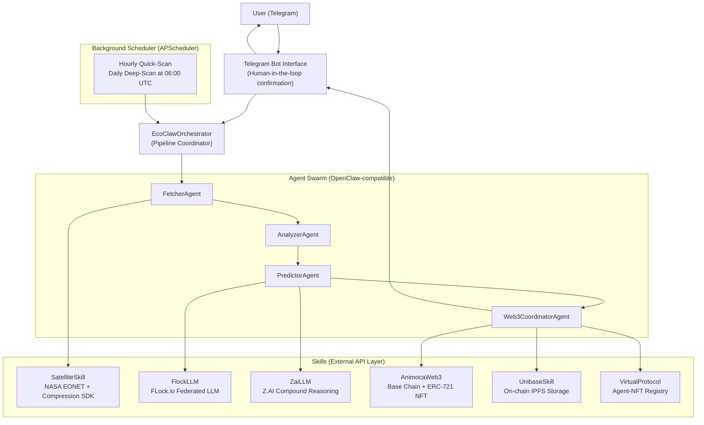

# EcoClaw

EcoClaw is an OpenClaw-compatible multi-agent system that autonomously monitors, analyses, and acts on real-time climate data using satellite imagery, federated LLMs, compound AI reasoning, and on-chain Web3 incentives.

---

## System Architecture



---

## Tech Stack

| Layer           | Technology                          |
| --------------- | ----------------------------------- |
| Agent Framework | OpenClaw-compatible `BaseAgent`     |
| LLM (federated) | FLock.io (deepseek-v3.2)            |
| LLM (reasoning) | Z.AI / GLM-4.5                      |
| Satellite data  | NASA EONET, Compression Company SDK |
| On-chain        | Base Sepolia (Animoca/Web3)         |
| Storage         | Unibase AIP 2.0 (IPFS)              |
| Agent registry  | Virtual Protocol                    |
| Interface       | Telegram Bot (python-telegram-bot)  |
| Scheduling      | APScheduler                         |
| Runtime         | Python 3.12, asyncio                |

---

## Quick Start

```bash
git clone https://github.com/0xshobha/ecoclaw
cd ecoclaw/ecoclaw
cp .env.example .env
# Edit .env with your API keys

python -m venv .venv && source .venv/bin/activate
pip install -r requirements.txt

# Run demo pipeline (mock mode, no keys needed)
python main.py --demo

# Run multi-region scan
python main.py --scan

# Start Telegram bot
python main.py
```

---

## Project Structure

```
ecoclaw/
├── agents/          BaseAgent + 4 specialised agents
├── config/          Settings and environment
├── interfaces/      Telegram bot (human-in-the-loop)
├── orchestrator/    Pipeline coordinator + scheduled scans
├── skills/          External API wrappers
├── utils/           Logging and helpers
├── data/            Cached satellite data (gitignored)
├── logs/            Rotating log files (gitignored)
├── Dockerfile
├── docker-compose.yml
└── main.py
```

---

## CLI Reference

| Command                               | Description                            |
| ------------------------------------- | -------------------------------------- |
| `python main.py`                      | Start Telegram bot in polling mode     |
| `python main.py --demo`               | Run a single pipeline query and exit   |
| `python main.py --demo --query "..."` | Run with a custom climate query        |
| `python main.py --scan`               | Run a scheduled 4-region scan and exit |

---

## Telegram Commands

| Command                      | Description                     |
| ---------------------------- | ------------------------------- |
| `/scan amazon deforestation` | Run the full 4-agent pipeline   |
| `/status`                    | Last scan summary               |
| `/register 0x...`            | Link EVM wallet for NFT rewards |
| `/agents`                    | List loaded agents              |
| `/help`                      | Show welcome message            |

Free-text queries trigger a human-in-the-loop confirmation before agents are dispatched.

---

## License

MIT
